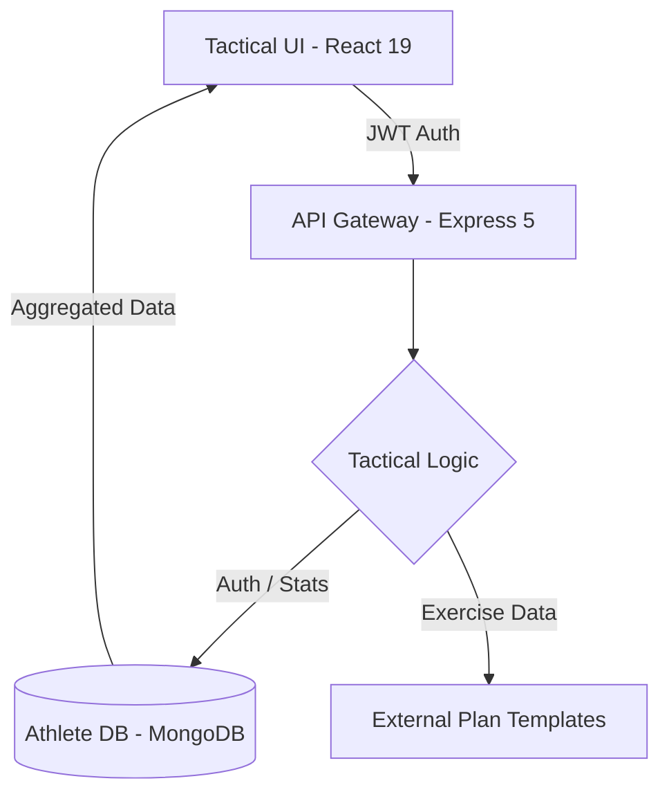

<div align="center">


# ⚡️ ACTIVE VISTA
### **THE CYBER-ATHLETIC COMMAND CENTER**

[](https://react.dev/)
[](https://tailwindcss.com/)
[](https://expressjs.com/)
[](https://www.mongodb.com/)

> **Track. Evolve. Dominate.**  
> ActiveVista is a futuristic fitness intelligence platform designed to transform every rep, step, and session into actionable intelligence. Built with a high-performance glassmorphic UI and a robust full-stack architecture.

[Explore Dashboard](#-command-center-features) • [Deployment Guide](#-deployment-orders) • [Tech Specs](#-technical-foundation)

</div>

---

## 🦾 THE COMMAND CENTER (FEATURES)

ActiveVista isn't just a tracker; it's your tactical advantage.

### 🎯 **INTELLIGENCE & ANALYTICS**
*   **Dynamic Dashboard**: Real-time visualization of your weekly activity, total caloric burn, and training consistency.
*   **Category Intelligence**: Automatic breakdown of Strength, Cardio, and Flexibility training via interactive Sunburst/Pie metrics.
*   **Step Logic**: Integrated daily step tracking with auto-derived mileage and physiological caloric estimation.

### 🏋️ **MISSION PROTOCOLS (PLANS)**
*   **30-Day Evolution**: Deploy structured mission plans (Fat Loss, Muscle Gain, Endurance) with day-by-day tactical execution.
*   **Adaptive Scheduling**: Seamlessly switch between mission protocols or terminate early with zero data loss.
*   **Tactical Logging**: Log freestyle workouts with precise sets, reps, and RPE-style tracking.

### 💠 **ELITE PERSONALIZATION**
*   **Profile Vault**: Secure storage of body metrics, fitness objectives, and equipment availability (Gym vs. Home).
*   **Glassmorphic Interface**: A premium, dark-mode-first UI inspired by high-end performance cockpits.

---

## 🛠 TECHNICAL FOUNDATION

### **The Stealth Stack**
| LAYER | TECH | UTILITY |
| :--- | :--- | :--- |
| **Frontend** | `React 19` + `Vite` | High-frequency UI updates and lightning-fast HMR. |
| **Styling** | `Tailwind CSS v4` | Custom utility-first design system with futuristic CSS tokens. |
| **Motion** | `Framer Motion` | Cinematic page transitions and micro-interactions. |
| **Intelligence** | `Express 5` | Robust RESTful API layer with optimized middleware logic. |
| **Storage** | `MongoDB Atlas` | High-availability NoSQL document store for athlete data. |
| **Security** | `JWT` + `Bcrypt` | Military-grade hash encryption and secure session handshake. |

---

## 🛸 VISUAL IDENTITY

<div align="center">
  
  
</div>

> *ActiveVista utilizes a custom "Deep Void" theme (#030508) with high-intensity "Glow Blue" (#1261A0) accents, ensuring high visibility during late-night training sessions.*

---

## 📡 DEPLOYMENT ORDERS

### **Prerequisites**
*   Node.js `v18.x` or higher
*   MongoDB Instance (Local or Atlas)
*   A hunger for absolute discipline

### **Initialize Phase**
```bash
# Clone the repository
git clone https://github.com/prasadaniket/ActiveVista.git
cd ActiveVista

# Install Client & Server Assets
npm install --prefix client
npm install --prefix server
```

### **Configure Environment**
Create a `.env` file in the `server/` directory:
```env
MONGODB_URL=your_mongodb_connection_string
JWT=your_tactical_encryption_key
PORT=4000
```

### **Execute Launch**
Run both command centers simultaneously:
```bash
# Terminal 1: Launch Backend
cd server
npm run dev

# Terminal 2: Initialize Stealth UI
cd client
npm run dev
```

---

## 🗺 THE ARCHITECTURE



---

## 📜 LICENSE
Distributed under the **MIT Elite License**. See `LICENSE` for more details.

<div align="center">
  <p>Engineered with ❤️ for athletes who demand the absolute best.</p>
  <b>© 2026 ACTIVE VISTA OPERATIONS</b>
</div>
