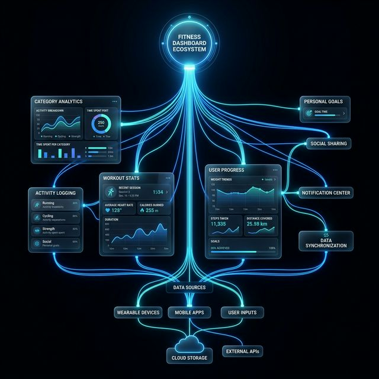
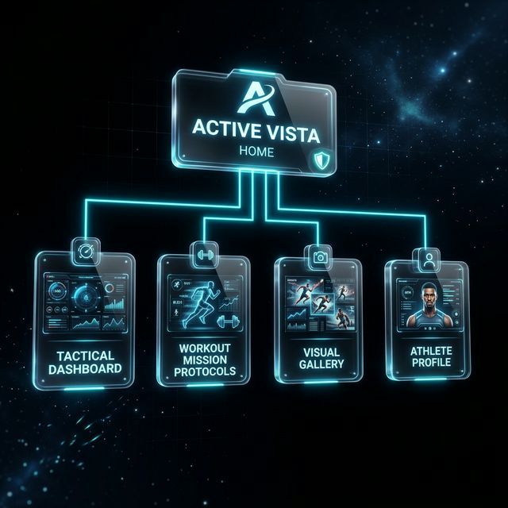

# ⚡ ACTIVE VISTA
### **THE FUTURE OF ATHLETIC INTELLIGENCE**

---

<p align="center">
  
</p>

---

## 🌌 THE MISSION
**ActiveVista** is a high-performance fitness command center designed to transform every training session into actionable intelligence. By combining a premium, **glassmorphic UI** with a robust full-stack foundation, it provides athletes with the tactical oversight required to dominate their fitness goals.

---

## 🏗️ SYSTEM ARCHITECTURE
Our architecture is engineered for low-latency data synchronization and high-fidelity visual rendering.

### **The Tactical Stack**
*   **Tactical UI**: Built on **React 19** and **Vite 7** for near-zero millisecond hot module replacement.
*   **Styling Core**: Custom **Tailwind CSS v4** implementation focusing on depth, translucency, and glow effects.
*   **Mission Logic**: **Express 5** backend managing JWT-secured mission handshakes and physiological data processing.
*   **Data Vault**: **MongoDB Atlas** high-availability storage for athlete profiles and training history.

<p align="center">
  
</p>

---

## ⚡ CORE CAPABILITIES

### **1. THE COMMAND CENTER**
Experience real-time telemetry of your training progress through an high-output dashboard.
- **Performance Intelligence**: Dynamic charts visualize weekly consistency and volume distribution.
- **Strategic Breakdown**: Automatic category classification (Cardio, Strength, Flexibility) derived from mission data.
- **Tactical Totals**: Persistent tracking of total workouts, cumulative calories, and average intensity.

### **2. MISSION PROTOCOLS**
Deploy and track structured 30-day training missions.
- **Protocol Management**: Activate elite pre-seeded plans or switch between missions on the fly.
- **Daily Execution**: A 30-day tactical calendar ensure no objective is missed.
- **Evolution Logic**: Plans adapt based on your difficulty level and historical performance.

### **3. PHYSIOLOGICAL TELEMETRY**
- **Dynamic Steps Tracker**: Input step volume with auto-calculating mileage and energy expenditure.
- **Tactical Free-Log**: Log freestyle sessions with precise set, rep, and duration tracking.

---

## 🧭 PLATFORM SITEMAP

<p align="center">
  
</p>

Our navigation is designed for **Minimal Friction**, ensuring athletes can move from the login handshake to mission logging in under three interactions.

---

## 🧬 TECHNICAL SPECIFICATIONS

| COMPONENT | TECHNOLOGY | ROLE |
| :--- | :--- | :--- |
| **Foundation** | React 19 / Vite 7 | Core UI Architecture |
| **Aesthetics** | Tailwind 4 / Framer Motion | Visual Identity & Motion |
| **Intelligence** | Express 5 / Node.js | API & Business Logic |
| **Storage** | Mongoose 8 / MongoDB | Athlete Data Persistence |
| **Security** | JWT / Bcrypt | Secure Tactical Access |

---

## 📡 DEPLOYMENT ORDERS

### **Initialize Phase**
```bash
# Clone the repository
git clone https://github.com/prasadaniket/ActiveVista.git

# Install Assets
cd ActiveVista
npm install --prefix client
npm install --prefix server
```

### **Configure Communications**
Create a `.env` file in the `/server` directory:
```env
MONGODB_URL=your_mongodb_uri
JWT=your_tactical_encryption_key
PORT=4000
```

### **Execute Launch**
```bash
# Launch Mission Control
cd server && npm run dev

# Initialize Stealth UI
cd client && npm run dev
```

---

<div align="center">
  <b>© 2026 ACTIVE VISTA OPERATIONS</b>  
  <i>Track. Evolve. Dominate.</i>
</div>
