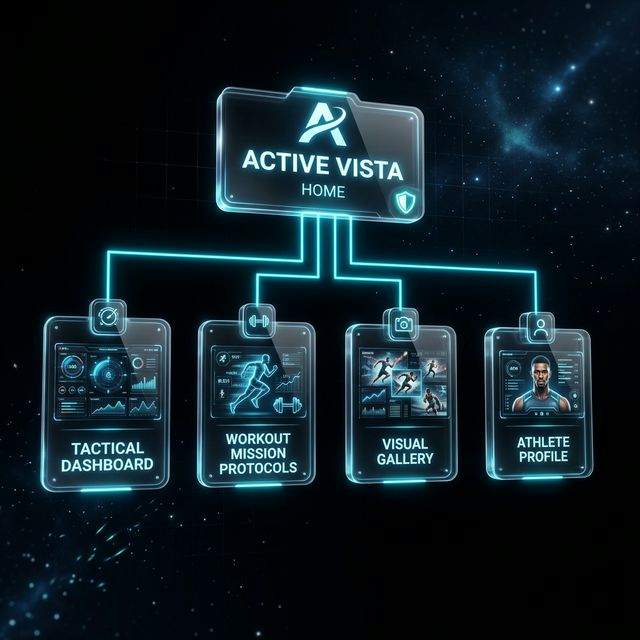

<div align="center">

# 💎 ACTIVE VISTA
### **Next-Gen Fitness Intelligence Command Center**
#### *A flagship product engineered under the UniCord digital ecosystem*

<br/>

[](https://github.com/prasadaniket)
[](LICENSE)
[](https://react.dev/)
[](https://tailwindcss.com/)
[](https://nodejs.org/)
[](https://expressjs.com/)
[](https://www.mongodb.com/)

<br/>

`DEEP VOID BLACK (#030712)` • `ELECTRIC GLOW BLUE (#1261A0)` • `GLASSMORPHIC ARCHITECTURE`

</div>

---

## 🌌 Overview

**ActiveVista** is a full-stack, enterprise-grade **Fitness Intelligence Platform** developed by **UniCord**. Designed for elite athletes, fitness enthusiasts, and personal training protocols, ActiveVista transforms routine workout tracking into a cinematic command center.

By combining real-time physiological metric tracking, interactive WebGL/Canvas dynamic motion effects, and strict backend security hardening, ActiveVista provides a synchronized dashboard for daily fitness performance, calorie metrics, and target mastery.

---

## 🏗️ System Architecture

<div align="center">
  
</div>

ActiveVista is architected around a resilient, decoupled client-server paradigm:

### 1. ⚡ Athlete Command Interface (`/client`)
- **React 19 & Vite 7**: Ultra-responsive SPA client with near-instant hot module replacement (HMR) and optimized modern bundle chunking.
- **Tailwind CSS v4 Engine**: Custom void design system with deep layered glassmorphic backdrops, radial blue glows, and sleek typography tokens.
- **Interactive Waves & Kinetic Motion**: Powered by custom Canvas Simplex noise fields, Three.js modules, and **Framer Motion 12** physics springs.
- **Accessible Primitives**: Built upon **Radix UI** primitives (`Dialog`, `HoverCard`, `Tooltip`, `Avatar`) for seamless keyboard and screen-reader accessibility.
- **State & Data Layer**: Client routing via **React Router 7**, centralized API pipelines via **Axios**, and reactive state management.

### 2. 🛡️ Intelligence Engine & API (`/server`)
- **Runtime**: **Node.js (>=18.0.0)** with **Express 5**.
- **Defense-in-Depth Security**: Stateless JSON Web Token (**JWT**) verification, **Bcrypt** cryptographic password hashing, **Helmet** HTTP header protection, **HPP** (HTTP Parameter Pollution) prevention, **Express Rate Limiting**, and **Mongo Sanitize** to defend against NoSQL injection vectors.
- **Data Vault**: High-availability cloud persistence via **MongoDB Atlas** and **Mongoose 8** schema contracts with automated calculation hooks.

<br/>

<div align="center">
  
</div>

---

## ⚡ Core Capabilities

| Capability | Technical Implementation | Athlete Experience |
| :--- | :--- | :--- |
| **📊 Tactical Dashboard** | Aggregated MongoDB analytics & interactive chart widgets | Instant overview of total workouts, cumulative calories burned, and target pacing. |
| **🏋️ Workout Logging Engine** | Dynamic categorization (Cardio, Strength, Flexibility, Endurance) | Granular entry of sets, reps, weight, duration, and calorie expenditure with date tags. |
| **🌊 Cinematic Canvas Waves** | Perlin/Simplex noise vector field rendered on HTML5 Canvas | Immersive cursor-reactive backdrop creating a living cyberpunk command atmosphere. |
| **🔒 Authenticated Profile Vault** | Secure JWT handshakes with Axios interceptors & auto-refresh | Complete data privacy with profile customization, workout records, and metrics history. |
| **🖼️ Active Media Gallery** | Responsive visual showcase with optimized layout grids | Visual repository documenting athlete transformations and training aesthetics. |

---

## 🧭 Navigation & Sitemap

<div align="center">
  
</div>

---

## 📂 Repository Structure

```tree
ActiveVista/
├── client/                      # Unified Frontend Athlete Client
│   ├── public/                  # Static assets, schematics & blueprints
│   │   ├── architect/           # Architecture diagrams
│   │   └── ...
│   ├── src/
│   │   ├── api/                 # Axios interceptors & API client instance
│   │   ├── components/          # Reusable UI & tactical components
│   │   │   ├── cards/           # Analytic metric cards & workout displays
│   │   │   ├── home_compo/      # Hero section, feature grids, FAQ, CTA
│   │   │   └── ui/              # Waves canvas, dialogs, buttons, toasts
│   │   ├── pages/               # Dashboard, Workout, Profile, Gallery, AboutUs
│   │   ├── App.jsx              # Application router & authentication provider
│   │   ├── index.css            # Tailwind v4 theme & glassmorphic styles
│   │   └── main.jsx             # React 19 entrypoint
│   ├── package.json
│   └── vite.config.js
│
├── server/                      # Tactical Backend REST API Service
│   ├── config/                  # MongoDB Atlas connection lifecycle
│   ├── controllers/             # User auth & workout business logic
│   ├── middleware/              # Auth guard & error handling middleware
│   ├── models/                  # Mongoose data schemas (User, Workout)
│   ├── routes/                  # RESTful API route definitions
│   ├── utils/                   # JWT generation & cryptographic helpers
│   ├── server.js                # Express 5 server initialization & security filters
│   └── package.json
│
├── LICENSE                      # MIT License (UniCord)
└── README.md                    # System Documentation
```

---

## 🔌 RESTful API Reference

All backend API routes are prefixed with `/api`.

### 🔑 Authentication & User Protocols
- `POST /api/user/signup` — Register new athlete profile with encrypted credentials.
- `POST /api/user/signin` — Authenticate user and issue secure JWT bearer token.
- `GET  /api/user/profile` — Fetch currently authenticated athlete profile data *(Protected)*.

### 📈 Intelligence & Dashboard Protocols
- `GET  /api/user/dashboard` — Fetch calculated metrics, daily calories burned, and workout analytics *(Protected)*.

### 🏋️ Workout Protocols
- `GET  /api/user/workout` — Retrieve workout records filtered by date parameter *(Protected)*.
- `POST /api/user/workout` — Record new workout session with category, sets, reps, and calories *(Protected)*.

---

## 🚀 Quick Start Guide

### Prerequisites
- **Node.js**: v18.0.0 or higher
- **npm**: v9.0.0 or higher
- **MongoDB Atlas** cluster URI

### 1. Clone the Repository
```bash
git clone https://github.com/prasadaniket/ActiveVista.git
cd ActiveVista
```

### 2. Configure Environment Variables
Create a `.env` file in the `server/` directory:

```env
# Server Network Config
PORT=8080
NODE_ENV=development

# MongoDB Atlas URI
MONGODB_URL=your_mongodb_connection_string

# JWT Secret Keys
JWT=your_ultra_secure_jwt_secret_key
JWT_REFRESH=your_ultra_secure_refresh_jwt_key

# Client CORS Origin
CLIENT_URL=http://localhost:5173
```

### 3. Install Dependencies
```bash
# Install Server Dependencies
npm install --prefix server

# Install Client Dependencies
npm install --prefix client
```

### 4. Launch Development Servers

**Run Server:**
```bash
cd server
npm run dev
# Server runs on http://localhost:8080
```

**Run Client (in a separate terminal):**
```bash
cd client
npm run dev
# Client runs on http://localhost:5173
```

---

## 🛡️ Security Hardening

ActiveVista implements robust security standards:
- **Rate Limiting**: Throttles brute-force attempts on sensitive API routes.
- **Sanitization**: Protects against NoSQL query injection across all payload bodies.
- **Helmet Security Headers**: Enforces strict CSP and MIME sniffing restrictions.
- **HPP Shield**: Prevents HTTP Parameter Pollution attacks.
- **Stateless Tokens**: Expirable JWTs verified at the gateway middleware level.

---

## 📜 License

This project is licensed under the **MIT License** — maintained and distributed by **UniCord**.  
See the [LICENSE](LICENSE) file for complete terms.

<!-- UniCord Product Ecosystem - ActiveVista v1.0 -->
<div align="center">
<br/>

**© 2026 UNICORD. ALL RIGHTS RESERVED.**  
*Engineered for Peak Human Performance.*

</div>
