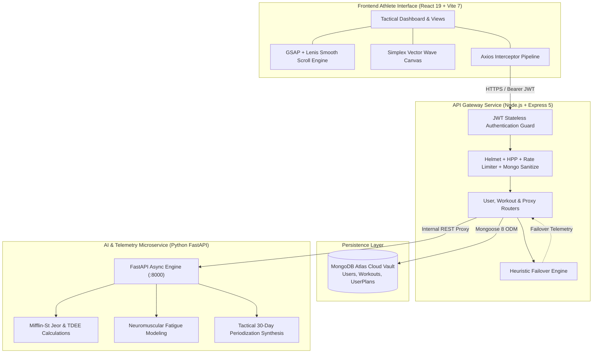
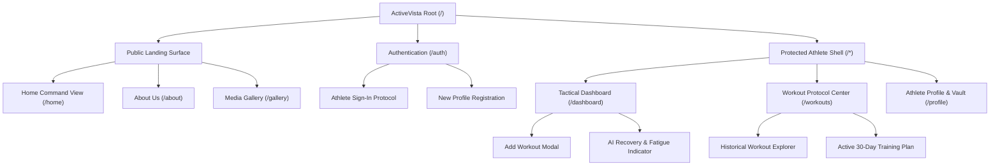
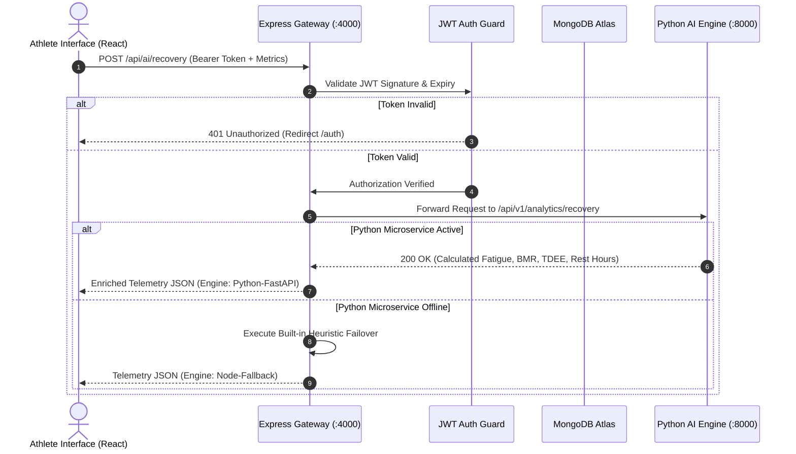

<!-- UniCord Enterprise Systems -->
<div align="center">

# ActiveVista
### Next-Generation Fitness Intelligence Command Center
**An Enterprise Platform Engineered under the UniCord Digital Ecosystem**

<br/>

[](https://github.com/prasadaniket)
[](LICENSE)
[](https://react.dev/)
[](https://tailwindcss.com/)
[](https://greensock.com/)
[](https://fastapi.tiangolo.com/)
[](https://nodejs.org/)
[](https://expressjs.com/)
[](https://www.mongodb.com/)

<br/>

`Deep Void Design System` | `Tri-Tier Microservice Topology` | `Physiological Telemetry Engine`

</div>

---

## 1. Executive Summary

**ActiveVista** is an enterprise-grade Fitness Intelligence Platform engineered by **UniCord**. Designed for athletes, health practitioners, and high-performance training protocols, ActiveVista transforms raw workout metrics and physiological telemetry into actionable intelligence through a centralized, dark-mode-first command center.

The platform architecture integrates an interactive **React 19** frontend, an **Express 5** API Gateway, an asynchronous **Python FastAPI** AI analytics microservice, and a cloud-native **MongoDB Atlas** persistence layer.

---

## 2. System Architecture

ActiveVista operates on a tri-tier, decoupled microservice topology engineered for high throughput, fault tolerance, and horizontal scalability.


```mermaid
flowchart TB
    subgraph ClientLayer["Frontend Athlete Interface (React 19 + Vite 7)"]
        UI["Tactical Dashboard & Views"]
        GSAP["GSAP + Lenis Smooth Scroll Engine"]
        WAVES["Simplex Vector Wave Canvas"]
        AXIOS["Axios Interceptor Pipeline"]
        UI --- GSAP
        UI --- WAVES
        UI --- AXIOS
    end

    subgraph GatewayLayer["API Gateway Service (Node.js + Express 5)"]
        AUTH["JWT Stateless Authentication Guard"]
        SECURITY["Helmet + HPP + Rate Limiter + Mongo Sanitize"]
        ROUTERS["User, Workout & Proxy Routers"]
        FALLBACK["Heuristic Failover Engine"]
        AUTH --> SECURITY
        SECURITY --> ROUTERS
        ROUTERS --> FALLBACK
    end

    subgraph DataLayer["Persistence Layer"]
        MONGO[("MongoDB Atlas Cloud Vault<br/>Users, Workouts, UserPlans")]
    end

    subgraph AILayer["AI & Telemetry Microservice (Python FastAPI)"]
        FASTAPI["FastAPI Async Engine (:8000)"]
        METRICS["Mifflin-St Jeor & TDEE Calculations"]
        FATIGUE["Neuromuscular Fatigue Modeling"]
        PLANNER["Tactical 30-Day Periodization Synthesis"]
        FASTAPI --> METRICS
        FASTAPI --> FATIGUE
        FASTAPI --> PLANNER
    end

    AXIOS -->|HTTPS / Bearer JWT| AUTH
    ROUTERS -->|Mongoose 8 ODM| MONGO
    ROUTERS -->|Internal REST Proxy| FASTAPI
    FALLBACK -.->|Failover Telemetry| ROUTERS
```

---

## 3. Technology Stack Specification

| Tier | Component | Technology | Version | Architectural Purpose |
| :--- | :--- | :--- | :--- | :--- |
| **Frontend** | Core Library | React | 19.1.1 | Component lifecycle and virtual DOM rendering |
| **Frontend** | Build Tool | Vite | 7.1.6 | High-speed ESM bundling and Hot Module Replacement |
| **Frontend** | Styling Framework | Tailwind CSS | 4.1.13 | Utility-first glassmorphic void theme tokens |
| **Frontend** | Kinetic Motion | GSAP & Lenis | 3.12 / 1.1 | 120 FPS momentum scrolling and micro-interactions |
| **Frontend** | Accessibility | Radix UI | Latest | WCAG-compliant primitives (Dialog, Tooltip, Avatar) |
| **Backend** | API Gateway | Express | 5.1.0 | RESTful routing, CORS, and request middleware pipeline |
| **Backend** | Runtime | Node.js | >= 18.0.0 | High-concurrency event-driven JavaScript engine |
| **Backend** | ODM | Mongoose | 8.18.1 | Schema validation and MongoDB lifecycle management |
| **Backend** | Security | Helmet / Bcrypt / HPP | Latest | HTTP security headers, hashing, and injection filters |
| **AI Engine** | Microservice Framework | FastAPI | >= 0.110.0 | High-performance asynchronous Python REST service |
| **AI Engine** | Data Validation | Pydantic | >= 2.6.0 | Strict runtime schema verification and OpenAPI generation |
| **AI Engine** | Computation | NumPy | >= 1.26.0 | Vectorized physiological calculations and fatigue curves |
| **Database** | Primary Storage | MongoDB Atlas | Cloud | Multi-collection document database |

---

## 4. Core Capabilities & Feature Modules

| Module | Architectural Implementation | Performance & User Capability |
| :--- | :--- | :--- |
| **Tactical Dashboard** | Aggregated MongoDB pipelines with reactive cards | Instant operational oversight on total workouts, cumulative caloric burn, and weekly goal pacing. |
| **Python Telemetry Engine** | FastAPI microservice with metabolic strain models | Computes Basal Metabolic Rate (BMR), Total Daily Energy Expenditure (TDEE), and rest recovery windows (24h vs 48h). |
| **Periodization Generator** | Algorithmic 30-day tactical training synthesis | Generates tailored exercise distributions (Hypertrophy, Strength, Fat Loss, Endurance) with nutrition macro splits. |
| **Workout Logging Engine** | Granular multi-category entry with date tagging | Enables athletes to record sessions with precise sets, reps, weight loads, duration, and energy expenditure metrics. |
| **Dynamic Vector Waves** | Simplex noise canvas with IntersectionObserver | Interactive cursor-reactive backdrop that automatically sleeps off-screen to preserve 0% idle CPU usage. |
| **Secure Authentication** | Stateless JWT bearer tokens with Axios interceptors | Complete data privacy with profile customization, workout records, and metrics history. |

---

## 5. Application Routing & Navigation Map


```mermaid
graph TD
    ROOT["ActiveVista Root (/)"] --> PUBLIC["Public Landing Surface"]
    ROOT --> AUTH_PAGE["Authentication (/auth)"]
    ROOT --> PROTECTED["Protected Athlete Shell (/*)"]

    PUBLIC --> HOME["Home Command View (/home)"]
    PUBLIC --> ABOUT["About Us (/about)"]
    PUBLIC --> GALLERY["Media Gallery (/gallery)"]

    AUTH_PAGE --> SIGNIN["Athlete Sign-In Protocol"]
    AUTH_PAGE --> SIGNUP["New Profile Registration"]

    PROTECTED --> DASHBOARD["Tactical Dashboard (/dashboard)"]
    PROTECTED --> WORKOUTS["Workout Protocol Center (/workouts)"]
    PROTECTED --> PROFILE["Athlete Profile & Vault (/profile)"]

    DASHBOARD --> LOG_MODAL["Add Workout Modal"]
    DASHBOARD --> RECOVERY_CARD["AI Recovery & Fatigue Indicator"]
    WORKOUTS --> HISTORY["Historical Workout Explorer"]
    WORKOUTS --> ACTIVE_PLAN["Active 30-Day Training Plan"]
```

---

## 6. Data & Request Lifecycle Flow

The sequence below illustrates the end-to-end data lifecycle when an athlete accesses physiological intelligence metrics:


```mermaid
sequenceDiagram
    autonumber
    actor Athlete as Athlete Interface (React)
    participant Gateway as Express Gateway (:4000)
    participant Auth as JWT Auth Guard
    participant DB as MongoDB Atlas
    participant PyEngine as Python AI Engine (:8000)

    Athlete->>Gateway: POST /api/ai/recovery (Bearer Token + Metrics)
    Gateway->>Auth: Validate JWT Signature & Expiry
    alt Token Invalid
        Auth-->>Athlete: 401 Unauthorized (Redirect /auth)
    else Token Valid
        Auth->>Gateway: Authorization Verified
        Gateway->>PyEngine: Forward Request to /api/v1/analytics/recovery
        alt Python Microservice Active
            PyEngine-->>Gateway: 200 OK (Calculated Fatigue, BMR, TDEE, Rest Hours)
            Gateway-->>Athlete: Enriched Telemetry JSON (Engine: Python-FastAPI)
        else Python Microservice Offline
            Gateway->>Gateway: Execute Built-in Heuristic Failover
            Gateway-->>Athlete: Telemetry JSON (Engine: Node-Fallback)
        end
    end
```

---

## 7. Directory Structure

```tree
ActiveVista/
├── package.json                # Root multi-service orchestrator (concurrently)
├── LICENSE                     # MIT License (UniCord)
├── README.md                   # System Architecture Documentation
│
├── ai-engine/                  # Python AI Intelligence Microservice
│   ├── app/
│   │   ├── api/                # REST endpoints (analytics, planner)
│   │   ├── core/               # Configuration settings and environment
│   │   ├── models/             # Pydantic data validation schemas
│   │   ├── services/           # Physiological math & fatigue algorithms
│   │   └── main.py             # FastAPI factory & CORS middleware
│   ├── tests/                  # Pytest unit tests
│   ├── Dockerfile              # Production container specification
│   ├── requirements.txt        # Python dependency manifest
│   ├── README.md               # AI Engine Documentation
│   └── run.py                  # Single-command startup script
│
├── client/                      # Frontend Single Page Application
│   ├── public/                  # Static assets and schemas
│   ├── src/
│   │   ├── api/                 # Axios interceptor instance and query keys
│   │   ├── components/          # UI primitives, GSAP smooth scroll, cards
│   │   │   ├── cards/           # Analytic metric cards and workout logs
│   │   │   ├── home_compo/      # Hero section, feature grids, and landing views
│   │   │   └── ui/              # Canvas waves, dialogs, buttons, toasts
│   │   ├── pages/               # Dashboard, Workout, Profile, Gallery, AboutUs
│   │   ├── App.jsx              # Application router and session provider
│   │   ├── index.css            # Tailwind CSS design system tokens
│   │   └── main.jsx             # React 19 entry point
│   ├── package.json
│   ├── vite.config.js
│   └── README.md
│
└── server/                      # Backend REST API Service
    ├── config/                  # MongoDB Atlas connection manager
    ├── controllers/             # Authentication and workout controllers
    ├── middleware/              # Auth guards, security, and error handlers
    ├── models/                  # Mongoose data schemas (User, Workout)
    ├── routes/                  # REST route definitions (user, workout, ai)
    ├── utils/                   # JWT utilities and helpers
    ├── server.js                # Express 5 initialization and security middleware
    ├── package.json
    └── SETUP.md
```

---

## 8. RESTful API Specification

All backend endpoints are scoped under the `/api` namespace.

| Domain | Method | Endpoint | Auth | Request Body | Response Payload | Description |
| :--- | :--- | :--- | :--- | :--- | :--- | :--- |
| **Auth** | `POST` | `/api/user/signup` | Public | `{ name, email, password }` | `{ user, token }` | Registers a new athlete profile with encrypted credentials. |
| **Auth** | `POST` | `/api/user/signin` | Public | `{ email, password }` | `{ user, token }` | Authenticates credentials and returns a signed JWT token. |
| **Auth** | `GET` | `/api/user/profile` | Bearer | None | `{ user }` | Retrieves authenticated user profile data. |
| **Analytics** | `GET` | `/api/user/dashboard` | Bearer | None | `{ totalWorkouts, totalCalories, ... }` | Aggregates daily burn metrics, workout counts, and weekly stats. |
| **Workouts** | `GET` | `/api/user/workout` | Bearer | Query: `?date=YYYY-MM-DD` | `[ workoutObjects ]` | Queries workout sessions filtered by target date. |
| **Workouts** | `POST` | `/api/user/workout` | Bearer | `{ workoutName, sets, reps, weight, ... }` | `{ workout }` | Records a new completed workout entry. |
| **AI Engine** | `POST` | `/api/ai/recovery` | Bearer | `{ weight_kg, height_cm, age, intensity, ... }` | `{ bmr, tdee, fatigue_score, rest_hours, ... }` | Proxies physiological strain calculations to the Python AI engine. |
| **AI Engine** | `POST` | `/api/ai/plan` | Bearer | `{ goal, difficulty, days_per_week, ... }` | `{ plan_title, schedule, nutrition_strategy }` | Generates personalized 30-day periodized training protocols. |

---

## 9. Environment Variables Reference

| Service | Variable Name | Required | Default Value | Description |
| :--- | :--- | :--- | :--- | :--- |
| **Server** | `PORT` | No | `4000` | Network port for Express API Gateway |
| **Server** | `NODE_ENV` | Yes | `development` | Runtime environment mode |
| **Server** | `MONGO_URI` / `MONGODB_URL` | Yes | - | MongoDB Atlas connection string |
| **Server** | `JWT` | Yes | - | Primary cryptographic secret key for JWT signing |
| **Server** | `JWT_REFRESH` | Yes | - | Secondary secret key for refresh token lifecycle |
| **Server** | `CLIENT_URL` | No | `http://localhost:5173` | Allowed CORS origin for frontend client |
| **Server** | `PYTHON_SERVICE_URL` | No | `http://localhost:8000` | Endpoint URL for the Python AI microservice |
| **AI Engine**| `PORT` | No | `8000` | Network port for Python FastAPI service |
| **Client** | `VITE_API_URL` | No | `http://localhost:4000/api` | Base API URL consumed by Axios client |

---

## 10. CLI Command Reference

Execute all commands directly from the root repository directory:

| Command | Target Scope | Execution Behavior |
| :--- | :--- | :--- |
| `npm run dev` | Fullstack | Launches **Express Server (`:4000`)** and **React Client (`:5173`)** concurrently in one terminal. |
| `npm run dev:all` | Full Ecosystem | Launches **Server (`:4000`)**, **Client (`:5173`)**, and **Python AI Engine (`:8000`)** simultaneously. |
| `npm run dev:server` | Backend | Starts the Express server standalone with Nodemon hot-reloading. |
| `npm run dev:client` | Frontend | Starts the Vite development server with Hot Module Replacement. |
| `npm run dev:ai` | AI Engine | Starts the Python FastAPI service on Uvicorn. |
| `npm run install:all` | All Services | Installs dependencies across Root, Client, and Server packages. |
| `npm run build` | Frontend | Bundles production-optimized static assets in `client/dist`. |
| `npm run lint` | Frontend | Runs ESLint validation across all client components and pages. |
| `npm start` | Production Server| Boots the backend API service in production mode. |

---

## 11. Security Compliance & Defense Architecture


```mermaid
flowchart LR
    REQ["Incoming Client Request"] --> RL["Rate Limiting Filter<br/>(Brute-Force Shield)"]
    RL --> HELMET["Helmet Headers<br/>(CSP / XSS / Clickjacking)"]
    HELMET --> HPP["HPP Protection<br/>(Parameter Pollution Shield)"]
    HPP --> SANITIZE["Mongo Sanitize<br/>(NoSQL Injection Shield)"]
    SANITIZE --> JWT_GUARD["Stateless JWT Guard<br/>(Bearer Token Verification)"]
    JWT_GUARD --> BCRYPT["Bcrypt Hashing<br/>(Salted Password Storage)"]
    BCRYPT --> CONTROLLER["Business Controller Execution"]
```

* **Stateless Token Management**: Expirable JSON Web Tokens verified at the gateway middleware layer.
* **NoSQL Injection Defense**: Automated sanitization removing `$` and `.` operators from request payloads.
* **Brute-Force Mitigation**: Endpoint throttling restricting rapid credential attempts.
* **Security Headers**: Standardized Helmet policy configurations enforcing strict CSP and MIME sniffing restrictions.
* **Resilient Service Fallback**: Built-in heuristic failover ensures uninterrupted frontend operation even during microservice maintenance.

---

## 12. License & Governance

This software is released under the **MIT License** by **UniCord**.  
Please refer to the [LICENSE](LICENSE) file for the complete terms and conditions.

<!-- UniCord Core Architecture v1.0 | Product ID: ActiveVista-2026 -->
<div align="center">
<br/>

**Copyright (c) 2026 UniCord. All rights reserved.**  
*Enterprise Health & Performance Technologies.*

</div>
